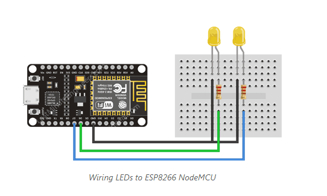

## Create A Simple ESP8266 NodeMCU Web Server In Arduino IDE

***The ESP8266 is a low-cost WiFi module that, with a little extra effort, can be programmed to run a standalone web server.***

It’s extremely simple. We’re going to control things by visiting a specific URL.

When you enter a URL into a web browser, it sends an HTTP request (also known as a GET request) to a web server. It is the web server’s responsibility to handle this request.

Assume you entered a URL like http://192.168.1.1/ledon into a browser. The browser then sends an HTTP request to the ESP8266. When the ESP8266 receives this request, it recognizes that the user wishes to turn on the LED. As a result, it turns on the LED and sends a dynamic webpage to a browser that displays the LED’s status as “on.” 

### Wiring LEDs to an ESP8266

